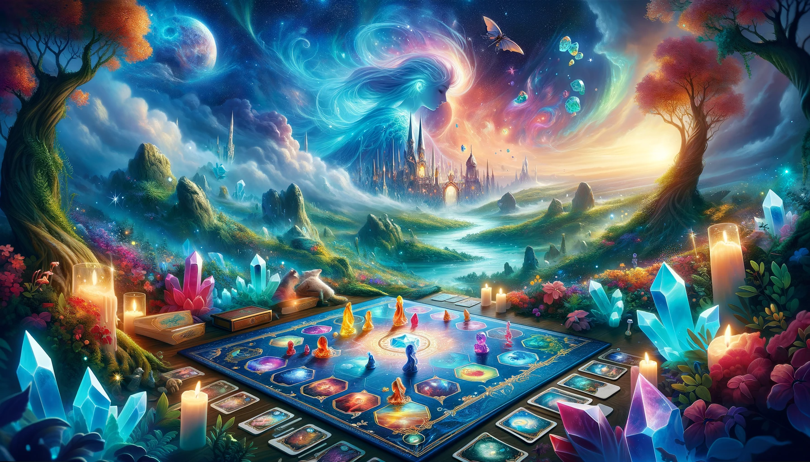

# Le Cristal des Rêves

Le Cristal des Rêves est un jeu de société coopératif et créatif qui invite les joueur·euse·s à plonger dans un univers onirique, afin de retrouver les fragments d’un cristal mystique et de sauver le monde des songes. Ce projet est Open Source et disponible pour toutes et tous, que vous souhaitiez contribuer, jouer, ou simplement explorer le monde du Cristal des Rêves.

## Table des Matières

- [Le Cristal des Rêves](#le-cristal-des-rêves)
  - [Table des Matières](#table-des-matières)
  - [Introduction](#introduction)
  - [Comment Jouer](#comment-jouer)
  - [Impression](#impression)
  - [Contribuer](#contribuer)
  - [Licence](#licence)
  - [Contact](#contact)
  - [Remerciements](#remerciements)

## Introduction

Les Gardien·ne·s des Rêves sont les dernier·ère·s espoir·s pour restaurer l'équilibre du monde des songes. Avec l'aide de visions oniriques et un esprit d'équipe solide, iels doivent retrouver les fragments dispersés du Cristal des Rêves avant que les forces du cauchemar ne s'emparent du monde. Ce jeu encourage la coopération, la créativité et l'imaginaire.

## Comment Jouer

Le jeu se joue en coopération, de 2 à 6 joueur·euse·s. Chaque joueur·euse prend le rôle d'un·e Gardien·ne des Rêves, et ensemble, iels doivent retrouver les fragments du Cristal des Rêves à travers divers défis et énigmes. Pour les règles complètes et les instructions de jeu, veuillez consulter le fichier [RULES.md](RULES.md).

## Impression

Vous aurez besoin d'imprimer certains composants du jeu. Vous pouvez trouver les fichiers imprimables dans le dossier [printables](printables/index.md).

## Contribuer

Le Cristal des Rêves est un projet Open Source, et nous accueillons chaleureusement les contributions de tout type ! Si vous avez une idée pour améliorer le jeu, corriger une erreur, ou quoi que ce soit d'autre, n'hésitez pas à créer une issue ou une pull request. Pour plus d'informations sur la manière de contribuer, consultez le fichier [CONTRIBUTING.md](CONTRIBUTING.md).

## Licence

Ce projet est distribué sous la licence MIT. Voir le fichier [LICENSE](LICENSE) pour plus d'informations.

## Contact

Si vous avez des questions, des suggestions, ou si vous souhaitez simplement entrer en contact avec les créateur·rice·s du Cristal des Rêves, n'hésitez pas à nous envoyer une [issue](link-to-your-issue-page).

## Remerciements

Nous tenons à remercier tou·te·s celles et ceux qui ont contribué à la réalisation du Cristal des Rêves, ainsi que la communauté fantastique qui a aidé à le rendre aussi spécial qu'il l'est aujourd'hui. Merci de croire en la magie des rêves !
